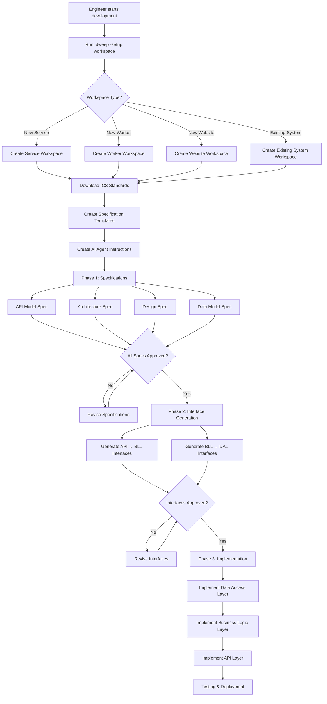

# ICS Development Process with dweep

This document outlines the complete development process that every ICS engineer must follow using the dweep tool.

## Process Overview



## Detailed Process Steps

### Step 1: Workspace Setup

Every engineer must create a standardized workspace:

```bash
# Navigate to workspaces directory
cd ~/workspaces

# Setup new workspace
dweep -setup workspace
```

**Interactive Setup:**
1. Choose workspace type (Service/Worker/Website/Existing)
2. Enter system name (e.g., `IslandManagementService`)
3. Confirm workspace name (auto-suggested: `{SystemName}-{username}`)

**Result:** Standardized workspace with ICS standards integration.

### Step 2: Standards Review (MANDATORY)

Before any development, engineers MUST review ICS standards:

```bash
cd ~/workspaces/{WorkspaceName}
open ICSCoreStandards/README.md
```

**Key Standards to Review:**
- Architecture Specifications
- API Design Specifications
- Design Specifications
- Development Process Specifications
- Testing Standards
- AWS Compatibility Standards

### Step 3: Phase 1 - Specification Creation (REQUIRED)

**All specifications MUST be created and approved before any code implementation.**

#### 3.1 Create Initial Specifications

```bash
q chat "Create initial specifications for {system_type} following ICS standards. 
Include:
1. API Model Specification with JSON Schema
2. Architecture Specification with 4-layer design
3. Design Specification with pattern selection
4. Data Model Specification with ADTs

Follow all ICS Core Standards requirements."
```

#### 3.2 Specification Requirements

**API Model Specification:**
- JSON Schema draft 4 compliance
- AWS-compatible field naming
- Required field specifications
- Validation rules

**Architecture Specification:**
- 4-layer architecture (API, Business, Data Access, Presentation)
- Component design
- Integration points
- Security requirements
- Scalability requirements

**Design Specification:**
- Selected design patterns with justification
- Component designs
- Interface definitions
- Implementation guidelines

**Data Model Specification:**
- Database schema definitions
- Abstract Data Type interfaces
- Data access patterns

#### 3.3 Specification Approval Process

1. **Create** specification using AI agent
2. **Review** against ICS standards
3. **Get team approval** (following 2 PR Rule)
4. **Commit** approved specification
5. **Proceed** to next specification

**CRITICAL:** No implementation can begin until ALL specifications are approved.

### Step 4: Phase 2 - Interface Generation

After all specifications are approved, generate shared interfaces:

```bash
q chat "Generate shared interfaces and contracts based on approved specifications:

1. API Layer ↔ Business Logic Layer interfaces
2. Business Logic Layer ↔ Data Access Layer interfaces
3. Common types and contracts
4. Abstract Data Type definitions

Ensure all interfaces follow ICS layer architecture standards and use only approved types from specifications."
```

**Interface Requirements:**
- Clear contract definitions between layers
- Type safety and validation
- Error handling contracts
- Versioning support

**Approval Required:** All interfaces must be reviewed and approved before implementation.

### Step 5: Phase 3 - Implementation

Implementation MUST follow layer order and use only approved specifications and interfaces:

#### 5.1 Data Access Layer Implementation

```bash
q chat "Implement Data Access Layer following approved specifications:

1. Use Data Models and Abstract Data Types only
2. Implement repository patterns
3. Handle data persistence and retrieval
4. Follow ICS layer architecture constraints
5. Do NOT expose database-specific details to upper layers

Use only approved interfaces and types. Do NOT create new types."
```

#### 5.2 Business Logic Layer Implementation

```bash
q chat "Implement Business Logic Layer following approved specifications:

1. Use Abstract Data Types and Common Types only
2. Implement core domain functionality
3. Maintain framework-agnostic design
4. Use approved interfaces for DAL communication
5. Follow ICS business layer constraints

Use only approved interfaces and types. Do NOT create new types."
```

#### 5.3 API Layer Implementation

```bash
q chat "Implement API Layer following approved specifications:

1. Use API Models and Common Types only
2. Implement semantic validation
3. Handle request/response transformation
4. Maintain AWS API compatibility
5. Use approved interfaces for BLL communication

Use only approved interfaces and types. Do NOT create new types."
```

### Step 6: Testing and Quality Assurance

Follow ICS testing standards:

```bash
q chat "Implement comprehensive testing following ICS test standards:

1. Key Tests for critical business logic
2. Unit Tests with 80% minimum coverage
3. Integration Tests for layer interactions
4. System Tests for end-to-end scenarios

Follow TDD approach and ensure all tests are deterministic and independent."
```

### Step 7: Deployment Preparation

Prepare for deployment following ICS standards:

```bash
q chat "Prepare deployment artifacts following ICS standards:

1. Docker containerization
2. Kubernetes deployment manifests
3. Configuration management
4. Monitoring and logging setup
5. Security configurations

Follow ICS operational excellence standards."
```

## AI Agent Constraints and Guidelines

### MUST NOT:
- Create new types without explicit specification approval
- Skip specification phase
- Implement across multiple layers simultaneously
- Break layer boundaries
- Violate ICS standards

### MUST:
- Use existing contracts and types only
- Follow 4-layer architecture
- Maintain AWS API compatibility
- Follow RFC 2119 compliance
- Get approval for new specifications

### Process for New Types:

If AI agent needs to create new types:

1. **STOP implementation**
2. **Ask user**: "New type '{TypeName}' is needed. Should I create a specification for this type?"
3. **Wait for approval**
4. **Create specification** for new type
5. **Get specification approved**
6. **Commit specification**
7. **Resume implementation** using approved type

## Quality Gates

### Specification Phase Gates:
- [ ] All specifications created
- [ ] All specifications reviewed against ICS standards
- [ ] All specifications approved by team
- [ ] All specifications committed

### Interface Phase Gates:
- [ ] All layer interfaces generated
- [ ] All contracts defined
- [ ] All interfaces reviewed and approved
- [ ] All interfaces committed

### Implementation Phase Gates:
- [ ] Data Access Layer implemented and tested
- [ ] Business Logic Layer implemented and tested
- [ ] API Layer implemented and tested
- [ ] All tests passing (80% minimum coverage)
- [ ] All quality checks passing

### Deployment Phase Gates:
- [ ] Security validation complete
- [ ] Performance testing complete
- [ ] Documentation complete
- [ ] Deployment artifacts ready

## Workspace Management

### List All Workspaces:
```bash
dweep -list
```

### Workspace Structure Validation:
Each workspace should contain:
- `ICSCoreStandards/` - Standards reference
- `specifications/` - All approved specifications
- `src/` - Implementation code
- `docs/` - Documentation
- `AI_AGENT_INSTRUCTIONS.md` - Agent guidance

### Workspace Cleanup:
- Remove unused workspaces regularly
- Archive completed projects
- Maintain workspace organization

## Troubleshooting

### Common Issues:

**"AI agent created new types without approval"**
- Stop implementation
- Create specification for new types
- Get approval
- Resume with approved types

**"Layer boundaries violated"**
- Review ICS layer architecture standards
- Refactor to maintain proper separation
- Use approved interfaces only

**"Specifications not approved"**
- Follow 2 PR Rule for approval
- Address review feedback
- Resubmit for approval

**"Tests failing"**
- Review ICS testing standards
- Ensure 80% minimum coverage
- Fix failing tests before proceeding

## Best Practices

### For Engineers:
1. **Always start with dweep workspace setup**
2. **Review ICS standards before development**
3. **Never skip specification phase**
4. **Get approvals before proceeding**
5. **Use AI agent instructions consistently**

### For AI Agents:
1. **Follow ICS standards strictly**
2. **Ask for approval when creating new types**
3. **Implement layers in correct order**
4. **Use only approved interfaces and types**
5. **Maintain layer boundaries**

### For Teams:
1. **Enforce specification approval process**
2. **Review against ICS standards**
3. **Maintain quality gates**
4. **Share best practices**
5. **Continuously improve process**

## Success Metrics

### Process Compliance:
- 100% of projects use dweep workspace setup
- 100% of projects have approved specifications
- 100% of projects follow layer architecture
- 100% of projects meet testing standards

### Quality Metrics:
- 80% minimum test coverage achieved
- Zero layer boundary violations
- AWS API compatibility maintained
- All quality gates passed

### Efficiency Metrics:
- Reduced setup time with dweep
- Faster development with standards
- Fewer defects with specifications
- Improved maintainability

This process ensures consistent, high-quality development across all ICS projects while maintaining compliance with ICS Core Standards.
